## ⚪ demo coverage: no floors yet, patch under 80%

[#561](https://github.com/acme/demo/pull/561) fix(calc): zero gets a name, and a store for the rows. Merge commit `3f2a9c1` into `main` at `bb1595f`, push 1. Patch coverage 46.7%, 7 of 15 changed lines, against the 80% target.

> [!NOTE]
> **No floors yet**, so nothing is gated. Run `coverreport ratchet` and commit `coverage/floors.json` to start the gate at today's numbers: every floor after that only rises.
> **Go unit patch coverage is 0.0%**, under the 80% target: 6 of 6 changed lines never ran. Informational until 2026-10-05, then it blocks.
> **Go sql patch coverage is 75.0%**, under the 80% target: 1 of 4 changed lines never ran. Informational until 2026-10-05, then it blocks.
> **Go live patch coverage is 30.0%**, under the 80% target: 7 of 10 changed lines never ran. Informational until 2026-10-05, then it blocks.

### Layers

```diff
@@ #561 push 1  3f2a9c1 into main  patch 46.7%  7/15 @@                                                    
#  state layer             now  ±floor  floor  target    patch         0        50      100                
!  warn  go unit         61.54       —      —    85.0     0.0% 0/6     ████████████·····│··  new floor 61.5
!  warn  go sql          66.67       —      —    80.0    75.0% 3/4     █████████████···│···  new floor 66.6
!  warn  go live         62.50       —      —       —    30.0% 3/10    ████████████▌·······  new floor 62.5
#  info  go e2e          62.50       —      —       —    30.0% 3/10    ▒▒▒▒▒▒▒▒▒▒▒▒········  report-only   
#  new   web lines       87.50       —      —    80.0    80.0% 4/5     █████████████████▌··  new floor 87.5
#  new   web branches    75.00       —      —    75.0                  ███████████████·····  new floor 75.0
#  new   web functions   75.00       —      —       —                  ███████████████·····  new floor 75.0
#  new   mobile          66.67       —      —       —        untouched █████████████·······  new floor 66.6
#  --    edge                —       —      —    95.0          not run ···················│  not affected  
```
<sub>Rows: <code>+</code> holds its floor, <code>!</code> patch under 80% (informational until 2026-10-05), <code>-</code> below its floor, <code>#</code> not gated here (report-only, untouched, not run, or no floor yet). Meters are 20 cells of 5%; <code>│</code> marks the target.</sub>



```mermaid
---
config:
  xyChart:
    width: 760
    height: 240
  themeVariables:
    xyChart:
      plotColorPalette: "#8c959f, #1f9d55"
---
xychart-beta horizontal
    title "Layers: now (green) inside target (grey)"
    x-axis ["go unit", "go sql", "web lines", "web branches"]
    y-axis "percent" 0 --> 100
    bar [85, 80, 80, 75]
    bar [61.54, 66.67, 87.50, 75.00]
```

### 8 changed lines have no test

| file | counts toward | changed lines | ran | no test yet |
|:--|:--|:--|--:|:--|
| [`calc.go`](https://github.com/acme/demo/blob/3f2a9c1d5e6f708192a3b4c5d6e7f8091a2b3c4d/libs/go/calc/calc.go)<br><sub>libs/go/calc</sub> | go unit<br>go live | `□□□□□□` | 0/6 | [L17–18](https://github.com/acme/demo/blob/3f2a9c1d5e6f708192a3b4c5d6e7f8091a2b3c4d/libs/go/calc/calc.go#L17-L18), [L35–39](https://github.com/acme/demo/blob/3f2a9c1d5e6f708192a3b4c5d6e7f8091a2b3c4d/libs/go/calc/calc.go#L35-L39) |
| [`button.tsx`](https://github.com/acme/demo/blob/3f2a9c1d5e6f708192a3b4c5d6e7f8091a2b3c4d/apps/web/src/components/button.tsx)<br><sub>apps/web/src/components</sub> | web | `■■□` | 2/3 | [L7](https://github.com/acme/demo/blob/3f2a9c1d5e6f708192a3b4c5d6e7f8091a2b3c4d/apps/web/src/components/button.tsx#L7) |
| [`store_pg.go`](https://github.com/acme/demo/blob/3f2a9c1d5e6f708192a3b4c5d6e7f8091a2b3c4d/libs/go/calc/store_pg.go)<br><sub>libs/go/calc</sub> | go sql<br>go live | `■■□■` | 3/4 | [L9](https://github.com/acme/demo/blob/3f2a9c1d5e6f708192a3b4c5d6e7f8091a2b3c4d/libs/go/calc/store_pg.go#L9) |

<details open>
<summary><code>libs/go/calc/calc.go</code> L17–18, L35–39</summary>

```diff
@@ calc.go  L13–21  Classify @@
    13 │     }
    14 │ 
    15 │     // Small numbers get a name.
    16 │     switch {
!   17 │     case n == 0:
!   18 │         return "zero", nil
    19 │     case n < 10:
    20 │         return "small", nil
    21 │     }
@@ calc.go  L31–40  Unused @@
    31 │     return total
    32 │ }
    33 │ 
    34 │ // Unused is never called.
!   35 │ func Unused() int {
!   36 │     a := 1
!   37 │     b := 2
    38 │ 
!   39 │     return a + b
    40 │ }
```

</details>
<details open>
<summary><code>apps/web/src/components/button.tsx</code> L7</summary>

```diff
@@ button.tsx  L3–8  IconButton @@
+    3 │   return <button className={cls}>Click</button>;
     4 │ }
     5 │ 
     6 │ export function IconButton() {
!    7 │   return <Button primary />;
     8 │ }
```

</details>
<details open>
<summary><code>libs/go/calc/store_pg.go</code> L9</summary>

```diff
@@ store_pg.go  L5–12  Load @@
     5 │ 
     6 │ // Load reads rows.
+    7 │ func (s *Store) Load() []int {
+    8 │     if s == nil {
!    9 │         return nil
    10 │     }
+   11 │     return s.rows
    12 │ }
```

</details>

### Go unit (logic): 61.54% over 1 package, most statements without a test first

<details>
<summary>1 package</summary>

```diff
#  package        floor     now  ±floor           patch   0        50      100           
!  libs/go/calc       —   61.54       —        0.0% 0/6   ████████████····│···  target 80
```

</details>

### Go SQL adapters (Postgres): 66.67% over 1 package, most statements without a test first

<details>
<summary>1 package</summary>

```diff
#  package        floor     now  ±floor           patch   0        50      100           
!  libs/go/calc       —   66.67       —       75.0% 3/4   █████████████···│···  target 80
```

</details>

### Go unit + Postgres: 62.50% over 1 package, most statements without a test first

<details>
<summary>1 package</summary>

```diff
#  package        floor     now  ±floor           patch   0        50      100
!  libs/go/calc       —   62.50       —      30.0% 3/10   ████████████▌·······
```

</details>

### Go e2e: 62.50% over 1 package, most statements without a test first

<details>
<summary>1 package</summary>

```diff
#  package        floor     now  ±floor           patch   0        50      100
!  libs/go/calc       —   62.50       —      30.0% 3/10   ████████████▌·······
```

</details>

### Web (vitest): 87.50% over 2 packages, most lines without a test first

<details open>
<summary>1 package (1 more at 100% is not listed)</summary>

```diff
#  package                   floor     now  ±floor           patch   0        50      100           
!  apps/web/src/components       —   66.67       —       66.7% 2/3   █████████████···│···  target 80
```

</details>

### Mobile (flutter): 66.67% over 1 package, most lines without a test first

<details>
<summary>1 package</summary>

```diff
#  package           floor     now  ±floor           patch   0        50      100
#  apps/mobile/lib       —   66.67       —               —   █████████████·······
```

</details>

<details>
<summary>Ratchet available: 10 floors can be created</summary>

Run `coverreport ratchet` and commit `coverage/floors.json`. These are the entries it rewrites:

```diff
@@ coverage/floors.json @@
   "layers": {
+    "go-live": { "statements": 62.5 }
+    "go-sql": { "statements": 66.6 }
+    "go-unit": { "statements": 61.5 }
+    "mobile": { "lines": 66.6 }
+    "web": { "branches": 75.0, "functions": 75.0, "lines": 87.5 }
   "packages": {
     "go-live": {
+      "libs/go/calc": { "statements": 62.5 }
     "go-unit": {
+      "libs/go/calc": { "statements": 61.5 }
   "globs": {
     "go-unit": {
+      "libs/go/calc/**": { "statements": 61.5 }
     "web": {
+      "apps/web/src/lib/**": { "branches": 100.0, "functions": 100.0, "lines": 100.0 }
+      "apps/web/src/{components,app}/**": { "branches": 50.0, "functions": 50.0, "lines": 66.6 }
```

</details>

### Go unit (logic) by glob

| glob | statements | floors | |
|:--|--:|--:|:--|
| `libs/go/calc/**`<br><sub>money path</sub> | 61.54% | — | `████████████······│·` |

### Web (vitest) by glob

| glob | lines | branches | functions | floors | |
|:--|--:|--:|--:|--:|:--|
| `apps/web/src/lib/**` | 100.00% | 100.00% | 100.00% | — / — / — | `████████████████████` |
| `apps/web/src/{components,app}/**` | 66.67% | 50.00% | 50.00% | — / — / — | `█████████████·······` |

### Lowest files per layer

Most units without a test first: where one test buys the most.

<details>
<summary>Go unit (logic)</summary>

| file | ran | of | |
|:--|--:|--:|:--|
| `libs/go/calc/calc.go` | 8 | 13 stmts | `████████████········` |

</details>
<details>
<summary>Go SQL adapters (Postgres)</summary>

| file | ran | of | |
|:--|--:|--:|:--|
| `libs/go/calc/store_pg.go` | 2 | 3 stmts | `█████████████·······` |

</details>
<details>
<summary>Go unit + Postgres</summary>

| file | ran | of | |
|:--|--:|--:|:--|
| `libs/go/calc/calc.go` | 8 | 13 stmts | `████████████········` |
| `libs/go/calc/store_pg.go` | 2 | 3 stmts | `█████████████·······` |

</details>
<details>
<summary>Go e2e</summary>

| file | ran | of | |
|:--|--:|--:|:--|
| `libs/go/calc/calc.go` | 8 | 13 stmts | `████████████········` |
| `libs/go/calc/store_pg.go` | 2 | 3 stmts | `█████████████·······` |

</details>
<details>
<summary>Web (vitest)</summary>

| file | ran | of | |
|:--|--:|--:|:--|
| `apps/web/src/components/button.tsx` | 2 | 3 lines | `█████████████·······` |

</details>
<details>
<summary>Mobile (flutter)</summary>

| file | ran | of | |
|:--|--:|--:|:--|
| `apps/mobile/lib/main_screen.dart` | 2 | 3 lines | `█████████████·······` |

</details>

### Left out of the denominator: 12 statements and 3 lines

| glob | why | size |
|:--|:--|--:|
| `**/*_templ.go` | templ codegen | 2 stmts in go-unit<br>2 stmts in go-live<br>2 stmts in go-e2e |
| `libs/go/svc/*/main.go` | thin wiring; the e2e lane measures it | 2 stmts in go-unit<br>2 stmts in go-live<br>2 stmts in go-e2e |
| `apps/web/src/components/ui/**` | vendored shadcn | 1 line in web |
| `apps/mobile/lib/**/*.g.dart` | drift codegen | 2 lines in mobile |
| `apps/web/src/legacy/**` | deleted last quarter | nothing measured |

From `coverage/exclude.txt`: every rule is printed with its size, so an exclusion cannot hide code quietly.

Layer boundaries (each layer's own include/exclude):

| layer | rule | size |
|:--|:--|--:|
| go unit | exclude `libs/go/**/store_pg.go` | 3 stmts |
| go sql | not included | 17 stmts |

### How this was measured

| layer | how | inputs |
|:--|:--|:--|
| go unit | go test -covermode=atomic -coverpkg=./..., database unset; SQL adapters are go-sql's (mode atomic) | `coverage-go/unit.out` |
| go sql | go (mode atomic) | `coverage-go/live.out` |
| go live | go (mode atomic) | `coverage-go/live.out` |
| go e2e | go (mode atomic) | `coverage-go-e2e/e2e.out` |
| web | lcov | `coverage-web/shard-1/lcov.info`<br>`coverage-web/shard-2/lcov.info` |
| mobile | lcov | `coverage-mobile/lcov.info` |
| patch | the diff against the base: 8 files, 38 lines added | |

<sub>[Run](https://github.com/acme/demo/actions/runs/18342917305). 15:42 UTC, Sep 28. coverreport v0.1.0.</sub>
