## 🟡 handipay coverage: floors hold, patch under 80%

[#561](https://github.com/acme/demo/pull/561) fix(calc): zero gets a name, and a store for the rows. Merge commit `3f2a9c1` into `main` at `bb1595f`, push 1. Patch coverage 53.1%, 153 of 288 changed lines, against the 80% target.

> [!NOTE]
> **Go unit patch coverage is 53.1%**, under the 80% target: 135 of 288 changed lines never ran. Informational until 2026-10-05, then it blocks.

### Layers

```diff
@@ #561 push 1  3f2a9c1 into main  patch 53.1%  153/288 @@                                            
#  state layer       now  ±floor  floor  target    patch         0        50      100                 
!  warn  go unit   53.13   +3.13   50.0    85.0    53.1% 153/288 ██████████▌······│··  ratchet to 53.1
```
<sub>Rows: <code>+</code> holds its floor, <code>!</code> patch under 80% (informational until 2026-10-05), <code>-</code> below its floor, <code>#</code> not gated here (report-only, untouched, not run, or no floor yet). Meters are 20 cells of 5%; <code>│</code> marks the target.</sub>



```mermaid
---
config:
  xyChart:
    width: 760
    height: 150
  themeVariables:
    xyChart:
      plotColorPalette: "#8c959f, #1f9d55"
---
xychart-beta horizontal
    title "Layers: now (green) inside target (grey)"
    x-axis ["go unit"]
    y-axis "percent" 0 --> 100
    bar [85]
    bar [53.13]
```

### 135 changed lines have no test

| file | counts toward | changed lines | ran | no test yet |
|:--|:--|:--|--:|:--|
| [`file01.go`](https://github.com/acme/demo/blob/3f2a9c1d5e6f708192a3b4c5d6e7f8091a2b3c4d/pkg/area00/unit00/file01.go)<br><sub>pkg/area00/unit00</sub> | go unit | `■■■□□□■■■□□□■■■□□□` | 9/18 | [L8–10](https://github.com/acme/demo/blob/3f2a9c1d5e6f708192a3b4c5d6e7f8091a2b3c4d/pkg/area00/unit00/file01.go#L8-L10), [L18–20](https://github.com/acme/demo/blob/3f2a9c1d5e6f708192a3b4c5d6e7f8091a2b3c4d/pkg/area00/unit00/file01.go#L18-L20), [L28–30](https://github.com/acme/demo/blob/3f2a9c1d5e6f708192a3b4c5d6e7f8091a2b3c4d/pkg/area00/unit00/file01.go#L28-L30) |
| [`file00.go`](https://github.com/acme/demo/blob/3f2a9c1d5e6f708192a3b4c5d6e7f8091a2b3c4d/pkg/area00/unit01/file00.go)<br><sub>pkg/area00/unit01</sub> | go unit | `■■■□□□■■■□□□■■■□□□` | 9/18 | [L8–10](https://github.com/acme/demo/blob/3f2a9c1d5e6f708192a3b4c5d6e7f8091a2b3c4d/pkg/area00/unit01/file00.go#L8-L10), [L18–20](https://github.com/acme/demo/blob/3f2a9c1d5e6f708192a3b4c5d6e7f8091a2b3c4d/pkg/area00/unit01/file00.go#L18-L20), [L28–30](https://github.com/acme/demo/blob/3f2a9c1d5e6f708192a3b4c5d6e7f8091a2b3c4d/pkg/area00/unit01/file00.go#L28-L30) |
| [`file01.go`](https://github.com/acme/demo/blob/3f2a9c1d5e6f708192a3b4c5d6e7f8091a2b3c4d/pkg/area00/unit01/file01.go)<br><sub>pkg/area00/unit01</sub> | go unit | `■■■□□□■■■□□□■■■□□□` | 9/18 | [L8–10](https://github.com/acme/demo/blob/3f2a9c1d5e6f708192a3b4c5d6e7f8091a2b3c4d/pkg/area00/unit01/file01.go#L8-L10), [L18–20](https://github.com/acme/demo/blob/3f2a9c1d5e6f708192a3b4c5d6e7f8091a2b3c4d/pkg/area00/unit01/file01.go#L18-L20), [L28–30](https://github.com/acme/demo/blob/3f2a9c1d5e6f708192a3b4c5d6e7f8091a2b3c4d/pkg/area00/unit01/file01.go#L28-L30) |
| [`file00.go`](https://github.com/acme/demo/blob/3f2a9c1d5e6f708192a3b4c5d6e7f8091a2b3c4d/pkg/area00/unit02/file00.go)<br><sub>pkg/area00/unit02</sub> | go unit | `■■■□□□■■■□□□■■■□□□` | 9/18 | [L8–10](https://github.com/acme/demo/blob/3f2a9c1d5e6f708192a3b4c5d6e7f8091a2b3c4d/pkg/area00/unit02/file00.go#L8-L10), [L18–20](https://github.com/acme/demo/blob/3f2a9c1d5e6f708192a3b4c5d6e7f8091a2b3c4d/pkg/area00/unit02/file00.go#L18-L20), [L28–30](https://github.com/acme/demo/blob/3f2a9c1d5e6f708192a3b4c5d6e7f8091a2b3c4d/pkg/area00/unit02/file00.go#L28-L30) |
| [`file01.go`](https://github.com/acme/demo/blob/3f2a9c1d5e6f708192a3b4c5d6e7f8091a2b3c4d/pkg/area00/unit02/file01.go)<br><sub>pkg/area00/unit02</sub> | go unit | `■■■□□□■■■□□□■■■□□□` | 9/18 | [L8–10](https://github.com/acme/demo/blob/3f2a9c1d5e6f708192a3b4c5d6e7f8091a2b3c4d/pkg/area00/unit02/file01.go#L8-L10), [L18–20](https://github.com/acme/demo/blob/3f2a9c1d5e6f708192a3b4c5d6e7f8091a2b3c4d/pkg/area00/unit02/file01.go#L18-L20), [L28–30](https://github.com/acme/demo/blob/3f2a9c1d5e6f708192a3b4c5d6e7f8091a2b3c4d/pkg/area00/unit02/file01.go#L28-L30) |
| [`file00.go`](https://github.com/acme/demo/blob/3f2a9c1d5e6f708192a3b4c5d6e7f8091a2b3c4d/pkg/area00/unit03/file00.go)<br><sub>pkg/area00/unit03</sub> | go unit | `■■■□□□■■■□□□■■■□□□` | 9/18 | [L8–10](https://github.com/acme/demo/blob/3f2a9c1d5e6f708192a3b4c5d6e7f8091a2b3c4d/pkg/area00/unit03/file00.go#L8-L10), [L18–20](https://github.com/acme/demo/blob/3f2a9c1d5e6f708192a3b4c5d6e7f8091a2b3c4d/pkg/area00/unit03/file00.go#L18-L20), [L28–30](https://github.com/acme/demo/blob/3f2a9c1d5e6f708192a3b4c5d6e7f8091a2b3c4d/pkg/area00/unit03/file00.go#L28-L30) |
| [`file01.go`](https://github.com/acme/demo/blob/3f2a9c1d5e6f708192a3b4c5d6e7f8091a2b3c4d/pkg/area00/unit03/file01.go)<br><sub>pkg/area00/unit03</sub> | go unit | `■■■□□□■■■□□□■■■□□□` | 9/18 | [L8–10](https://github.com/acme/demo/blob/3f2a9c1d5e6f708192a3b4c5d6e7f8091a2b3c4d/pkg/area00/unit03/file01.go#L8-L10), [L18–20](https://github.com/acme/demo/blob/3f2a9c1d5e6f708192a3b4c5d6e7f8091a2b3c4d/pkg/area00/unit03/file01.go#L18-L20), [L28–30](https://github.com/acme/demo/blob/3f2a9c1d5e6f708192a3b4c5d6e7f8091a2b3c4d/pkg/area00/unit03/file01.go#L28-L30) |
| [`file00.go`](https://github.com/acme/demo/blob/3f2a9c1d5e6f708192a3b4c5d6e7f8091a2b3c4d/pkg/area01/unit04/file00.go)<br><sub>pkg/area01/unit04</sub> | go unit | `■■■□□□■■■□□□■■■□□□` | 9/18 | [L8–10](https://github.com/acme/demo/blob/3f2a9c1d5e6f708192a3b4c5d6e7f8091a2b3c4d/pkg/area01/unit04/file00.go#L8-L10), [L18–20](https://github.com/acme/demo/blob/3f2a9c1d5e6f708192a3b4c5d6e7f8091a2b3c4d/pkg/area01/unit04/file00.go#L18-L20), [L28–30](https://github.com/acme/demo/blob/3f2a9c1d5e6f708192a3b4c5d6e7f8091a2b3c4d/pkg/area01/unit04/file00.go#L28-L30) |
| [`file01.go`](https://github.com/acme/demo/blob/3f2a9c1d5e6f708192a3b4c5d6e7f8091a2b3c4d/pkg/area01/unit05/file01.go)<br><sub>pkg/area01/unit05</sub> | go unit | `■■■□□□■■■□□□■■■□□□` | 9/18 | [L8–10](https://github.com/acme/demo/blob/3f2a9c1d5e6f708192a3b4c5d6e7f8091a2b3c4d/pkg/area01/unit05/file01.go#L8-L10), [L18–20](https://github.com/acme/demo/blob/3f2a9c1d5e6f708192a3b4c5d6e7f8091a2b3c4d/pkg/area01/unit05/file01.go#L18-L20), [L28–30](https://github.com/acme/demo/blob/3f2a9c1d5e6f708192a3b4c5d6e7f8091a2b3c4d/pkg/area01/unit05/file01.go#L28-L30) |
| [`file00.go`](https://github.com/acme/demo/blob/3f2a9c1d5e6f708192a3b4c5d6e7f8091a2b3c4d/pkg/area01/unit06/file00.go)<br><sub>pkg/area01/unit06</sub> | go unit | `■■■□□□■■■□□□■■■□□□` | 9/18 | [L8–10](https://github.com/acme/demo/blob/3f2a9c1d5e6f708192a3b4c5d6e7f8091a2b3c4d/pkg/area01/unit06/file00.go#L8-L10), [L18–20](https://github.com/acme/demo/blob/3f2a9c1d5e6f708192a3b4c5d6e7f8091a2b3c4d/pkg/area01/unit06/file00.go#L18-L20), [L28–30](https://github.com/acme/demo/blob/3f2a9c1d5e6f708192a3b4c5d6e7f8091a2b3c4d/pkg/area01/unit06/file00.go#L28-L30) |
| [`file01.go`](https://github.com/acme/demo/blob/3f2a9c1d5e6f708192a3b4c5d6e7f8091a2b3c4d/pkg/area01/unit06/file01.go)<br><sub>pkg/area01/unit06</sub> | go unit | `■■■□□□■■■□□□■■■□□□` | 9/18 | [L8–10](https://github.com/acme/demo/blob/3f2a9c1d5e6f708192a3b4c5d6e7f8091a2b3c4d/pkg/area01/unit06/file01.go#L8-L10), [L18–20](https://github.com/acme/demo/blob/3f2a9c1d5e6f708192a3b4c5d6e7f8091a2b3c4d/pkg/area01/unit06/file01.go#L18-L20), [L28–30](https://github.com/acme/demo/blob/3f2a9c1d5e6f708192a3b4c5d6e7f8091a2b3c4d/pkg/area01/unit06/file01.go#L28-L30) |
| [`file00.go`](https://github.com/acme/demo/blob/3f2a9c1d5e6f708192a3b4c5d6e7f8091a2b3c4d/pkg/area01/unit07/file00.go)<br><sub>pkg/area01/unit07</sub> | go unit | `■■■□□□■■■□□□■■■□□□` | 9/18 | [L8–10](https://github.com/acme/demo/blob/3f2a9c1d5e6f708192a3b4c5d6e7f8091a2b3c4d/pkg/area01/unit07/file00.go#L8-L10), [L18–20](https://github.com/acme/demo/blob/3f2a9c1d5e6f708192a3b4c5d6e7f8091a2b3c4d/pkg/area01/unit07/file00.go#L18-L20), [L28–30](https://github.com/acme/demo/blob/3f2a9c1d5e6f708192a3b4c5d6e7f8091a2b3c4d/pkg/area01/unit07/file00.go#L28-L30) |
| [`file01.go`](https://github.com/acme/demo/blob/3f2a9c1d5e6f708192a3b4c5d6e7f8091a2b3c4d/pkg/area01/unit07/file01.go)<br><sub>pkg/area01/unit07</sub> | go unit | `■■■□□□■■■□□□■■■□□□` | 9/18 | [L8–10](https://github.com/acme/demo/blob/3f2a9c1d5e6f708192a3b4c5d6e7f8091a2b3c4d/pkg/area01/unit07/file01.go#L8-L10), [L18–20](https://github.com/acme/demo/blob/3f2a9c1d5e6f708192a3b4c5d6e7f8091a2b3c4d/pkg/area01/unit07/file01.go#L18-L20), [L28–30](https://github.com/acme/demo/blob/3f2a9c1d5e6f708192a3b4c5d6e7f8091a2b3c4d/pkg/area01/unit07/file01.go#L28-L30) |
| [`file00.go`](https://github.com/acme/demo/blob/3f2a9c1d5e6f708192a3b4c5d6e7f8091a2b3c4d/pkg/area00/unit00/file00.go)<br><sub>pkg/area00/unit00</sub> | go unit | `■■■■■■■■■□□□■■■□□□` | 12/18 | [L18–20](https://github.com/acme/demo/blob/3f2a9c1d5e6f708192a3b4c5d6e7f8091a2b3c4d/pkg/area00/unit00/file00.go#L18-L20), [L28–30](https://github.com/acme/demo/blob/3f2a9c1d5e6f708192a3b4c5d6e7f8091a2b3c4d/pkg/area00/unit00/file00.go#L28-L30) |
| [`file01.go`](https://github.com/acme/demo/blob/3f2a9c1d5e6f708192a3b4c5d6e7f8091a2b3c4d/pkg/area01/unit04/file01.go)<br><sub>pkg/area01/unit04</sub> | go unit | `■■■■■■■■■□□□■■■□□□` | 12/18 | [L18–20](https://github.com/acme/demo/blob/3f2a9c1d5e6f708192a3b4c5d6e7f8091a2b3c4d/pkg/area01/unit04/file01.go#L18-L20), [L28–30](https://github.com/acme/demo/blob/3f2a9c1d5e6f708192a3b4c5d6e7f8091a2b3c4d/pkg/area01/unit04/file01.go#L28-L30) |
| [`file00.go`](https://github.com/acme/demo/blob/3f2a9c1d5e6f708192a3b4c5d6e7f8091a2b3c4d/pkg/area01/unit05/file00.go)<br><sub>pkg/area01/unit05</sub> | go unit | `■■■■■■■■■□□□■■■□□□` | 12/18 | [L18–20](https://github.com/acme/demo/blob/3f2a9c1d5e6f708192a3b4c5d6e7f8091a2b3c4d/pkg/area01/unit05/file00.go#L18-L20), [L28–30](https://github.com/acme/demo/blob/3f2a9c1d5e6f708192a3b4c5d6e7f8091a2b3c4d/pkg/area01/unit05/file00.go#L28-L30) |

<details open>
<summary><code>pkg/area00/unit00/file01.go</code> L8–10, L18–20, L28–30</summary>

```diff
@@ file01.go  L4–32  F1_1 @@
+    4 │     y := x * 2
+    5 │     return y + 0
     6 │ }
     7 │ 
!    8 │ func F1_1(x int) int {
!    9 │     y := x * 3
!   10 │     return y + 0
    11 │ }
    12 │ 
+   13 │ func F1_2(x int) int {
+   14 │     y := x * 4
+   15 │     return y + 0
    16 │ }
    17 │ 
!   18 │ func F1_3(x int) int {
!   19 │     y := x * 5
!   20 │     return y + 0
    21 │ }
    22 │ 
+   23 │ func F1_4(x int) int {
+   24 │     y := x * 6
+   25 │     return y + 0
    26 │ }
    27 │ 
!   28 │ func F1_5(x int) int {
!   29 │     y := x * 7
!   30 │     return y + 0
    31 │ }
    32 │ 
```

</details>
<details open>
<summary><code>pkg/area00/unit01/file00.go</code> L8–10, L18–20, L28–30</summary>

```diff
@@ file00.go  L4–32  F0_1 @@
+    4 │     y := x * 2
+    5 │     return y + 1
     6 │ }
     7 │ 
!    8 │ func F0_1(x int) int {
!    9 │     y := x * 3
!   10 │     return y + 1
    11 │ }
    12 │ 
+   13 │ func F0_2(x int) int {
+   14 │     y := x * 4
+   15 │     return y + 1
    16 │ }
    17 │ 
!   18 │ func F0_3(x int) int {
!   19 │     y := x * 5
!   20 │     return y + 1
    21 │ }
    22 │ 
+   23 │ func F0_4(x int) int {
+   24 │     y := x * 6
+   25 │     return y + 1
    26 │ }
    27 │ 
!   28 │ func F0_5(x int) int {
!   29 │     y := x * 7
!   30 │     return y + 1
    31 │ }
    32 │ 
```

</details>
<details open>
<summary><code>pkg/area00/unit01/file01.go</code> L8–10, L18–20, L28–30</summary>

```diff
@@ file01.go  L4–32  F1_1 @@
+    4 │     y := x * 2
+    5 │     return y + 1
     6 │ }
     7 │ 
!    8 │ func F1_1(x int) int {
!    9 │     y := x * 3
!   10 │     return y + 1
    11 │ }
    12 │ 
+   13 │ func F1_2(x int) int {
+   14 │     y := x * 4
+   15 │     return y + 1
    16 │ }
    17 │ 
!   18 │ func F1_3(x int) int {
!   19 │     y := x * 5
!   20 │     return y + 1
    21 │ }
    22 │ 
+   23 │ func F1_4(x int) int {
+   24 │     y := x * 6
+   25 │     return y + 1
    26 │ }
    27 │ 
!   28 │ func F1_5(x int) int {
!   29 │     y := x * 7
!   30 │     return y + 1
    31 │ }
    32 │ 
```

</details>
<details open>
<summary><code>pkg/area00/unit02/file00.go</code> L8–10, L18–20, L28–30</summary>

```diff
@@ file00.go  L4–32  F0_1 @@
+    4 │     y := x * 2
+    5 │     return y + 2
     6 │ }
     7 │ 
!    8 │ func F0_1(x int) int {
!    9 │     y := x * 3
!   10 │     return y + 2
    11 │ }
    12 │ 
+   13 │ func F0_2(x int) int {
+   14 │     y := x * 4
+   15 │     return y + 2
    16 │ }
    17 │ 
!   18 │ func F0_3(x int) int {
!   19 │     y := x * 5
!   20 │     return y + 2
    21 │ }
    22 │ 
+   23 │ func F0_4(x int) int {
+   24 │     y := x * 6
+   25 │     return y + 2
    26 │ }
    27 │ 
!   28 │ func F0_5(x int) int {
!   29 │     y := x * 7
!   30 │     return y + 2
    31 │ }
    32 │ 
```

</details>
<details open>
<summary><code>pkg/area00/unit02/file01.go</code> L8–10, L18–20, L28–30</summary>

```diff
@@ file01.go  L4–32  F1_1 @@
+    4 │     y := x * 2
+    5 │     return y + 2
     6 │ }
     7 │ 
!    8 │ func F1_1(x int) int {
!    9 │     y := x * 3
!   10 │     return y + 2
    11 │ }
    12 │ 
+   13 │ func F1_2(x int) int {
+   14 │     y := x * 4
+   15 │     return y + 2
    16 │ }
    17 │ 
!   18 │ func F1_3(x int) int {
!   19 │     y := x * 5
!   20 │     return y + 2
    21 │ }
    22 │ 
+   23 │ func F1_4(x int) int {
+   24 │     y := x * 6
+   25 │     return y + 2
    26 │ }
    27 │ 
!   28 │ func F1_5(x int) int {
!   29 │     y := x * 7
!   30 │     return y + 2
    31 │ }
    32 │ 
```

</details>
<details open>
<summary><code>pkg/area00/unit03/file00.go</code> L8–10, L18–20, L28–30</summary>

```diff
@@ file00.go  L4–32  F0_1 @@
+    4 │     y := x * 2
+    5 │     return y + 3
     6 │ }
     7 │ 
!    8 │ func F0_1(x int) int {
!    9 │     y := x * 3
!   10 │     return y + 3
    11 │ }
    12 │ 
+   13 │ func F0_2(x int) int {
+   14 │     y := x * 4
+   15 │     return y + 3
    16 │ }
    17 │ 
!   18 │ func F0_3(x int) int {
!   19 │     y := x * 5
!   20 │     return y + 3
    21 │ }
    22 │ 
+   23 │ func F0_4(x int) int {
+   24 │     y := x * 6
+   25 │     return y + 3
    26 │ }
    27 │ 
!   28 │ func F0_5(x int) int {
!   29 │     y := x * 7
!   30 │     return y + 3
    31 │ }
    32 │ 
```

</details>
<details open>
<summary><code>pkg/area00/unit03/file01.go</code> L8–10, L18–20, L28–30</summary>

```diff
@@ file01.go  L4–32  F1_1 @@
+    4 │     y := x * 2
+    5 │     return y + 3
     6 │ }
     7 │ 
!    8 │ func F1_1(x int) int {
!    9 │     y := x * 3
!   10 │     return y + 3
    11 │ }
    12 │ 
+   13 │ func F1_2(x int) int {
+   14 │     y := x * 4
+   15 │     return y + 3
    16 │ }
    17 │ 
!   18 │ func F1_3(x int) int {
!   19 │     y := x * 5
!   20 │     return y + 3
    21 │ }
    22 │ 
+   23 │ func F1_4(x int) int {
+   24 │     y := x * 6
+   25 │     return y + 3
    26 │ }
    27 │ 
!   28 │ func F1_5(x int) int {
!   29 │     y := x * 7
!   30 │     return y + 3
    31 │ }
    32 │ 
```

</details>
<details open>
<summary><code>pkg/area01/unit04/file00.go</code> L8–10, L18–20, L28–30</summary>

```diff
@@ file00.go  L4–32  F0_1 @@
+    4 │     y := x * 2
+    5 │     return y + 4
     6 │ }
     7 │ 
!    8 │ func F0_1(x int) int {
!    9 │     y := x * 3
!   10 │     return y + 4
    11 │ }
    12 │ 
+   13 │ func F0_2(x int) int {
+   14 │     y := x * 4
+   15 │     return y + 4
    16 │ }
    17 │ 
!   18 │ func F0_3(x int) int {
!   19 │     y := x * 5
!   20 │     return y + 4
    21 │ }
    22 │ 
+   23 │ func F0_4(x int) int {
+   24 │     y := x * 6
+   25 │     return y + 4
    26 │ }
    27 │ 
!   28 │ func F0_5(x int) int {
!   29 │     y := x * 7
!   30 │     return y + 4
    31 │ }
    32 │ 
```

</details>
<details open>
<summary><code>pkg/area01/unit05/file01.go</code> L8–10, L18–20, L28–30</summary>

```diff
@@ file01.go  L4–32  F1_1 @@
+    4 │     y := x * 2
+    5 │     return y + 5
     6 │ }
     7 │ 
!    8 │ func F1_1(x int) int {
!    9 │     y := x * 3
!   10 │     return y + 5
    11 │ }
    12 │ 
+   13 │ func F1_2(x int) int {
+   14 │     y := x * 4
+   15 │     return y + 5
    16 │ }
    17 │ 
!   18 │ func F1_3(x int) int {
!   19 │     y := x * 5
!   20 │     return y + 5
    21 │ }
    22 │ 
+   23 │ func F1_4(x int) int {
+   24 │     y := x * 6
+   25 │     return y + 5
    26 │ }
    27 │ 
!   28 │ func F1_5(x int) int {
!   29 │     y := x * 7
!   30 │     return y + 5
    31 │ }
    32 │ 
```

</details>
<details open>
<summary><code>pkg/area01/unit06/file00.go</code> L8–10, L18–20, L28–30</summary>

```diff
@@ file00.go  L4–32  F0_1 @@
+    4 │     y := x * 2
+    5 │     return y + 6
     6 │ }
     7 │ 
!    8 │ func F0_1(x int) int {
!    9 │     y := x * 3
!   10 │     return y + 6
    11 │ }
    12 │ 
+   13 │ func F0_2(x int) int {
+   14 │     y := x * 4
+   15 │     return y + 6
    16 │ }
    17 │ 
!   18 │ func F0_3(x int) int {
!   19 │     y := x * 5
!   20 │     return y + 6
    21 │ }
    22 │ 
+   23 │ func F0_4(x int) int {
+   24 │     y := x * 6
+   25 │     return y + 6
    26 │ }
    27 │ 
!   28 │ func F0_5(x int) int {
!   29 │     y := x * 7
!   30 │     return y + 6
    31 │ }
    32 │ 
```

</details>

### Go unit: 53.13% over 8 packages, most statements without a test first

<details open>
<summary>8 packages</summary>

```diff
#  package             floor     now  ±floor           patch   0        50      100           
!  pkg/area00/unit01       —   50.00       —     50.0% 18/36   ██████████······│···  target 80
!  pkg/area00/unit02       —   50.00       —     50.0% 18/36   ██████████······│···  target 80
!  pkg/area00/unit03       —   50.00       —     50.0% 18/36   ██████████······│···  target 80
!  pkg/area01/unit06       —   50.00       —     50.0% 18/36   ██████████······│···  target 80
!  pkg/area01/unit07       —   50.00       —     50.0% 18/36   ██████████······│···  target 80
!  pkg/area00/unit00       —   58.33       —     58.3% 21/36   ███████████▌····│···  target 80
!  pkg/area01/unit04       —   58.33       —     58.3% 21/36   ███████████▌····│···  target 80
!  pkg/area01/unit05       —   58.33       —     58.3% 21/36   ███████████▌····│···  target 80
```

</details>

<details>
<summary>Ratchet available: 1 floor can rise, 8 floors can be created</summary>

Run `coverreport ratchet` and commit `coverage/floors.json`. These are the entries it rewrites:

```diff
@@ coverage/floors.json @@
   "layers": {
-    "go-unit": { "statements": 50.0 }
+    "go-unit": { "statements": 53.1 }
   "packages": {
     "go-unit": {
+      "pkg/area00/unit00": { "statements": 58.3 }
+      "pkg/area00/unit01": { "statements": 50.0 }
+      "pkg/area00/unit02": { "statements": 50.0 }
+      "pkg/area00/unit03": { "statements": 50.0 }
+      "pkg/area01/unit04": { "statements": 58.3 }
+      "pkg/area01/unit05": { "statements": 58.3 }
+      "pkg/area01/unit06": { "statements": 50.0 }
+      "pkg/area01/unit07": { "statements": 50.0 }
```

</details>

### Lowest files per layer

Most units without a test first: where one test buys the most.

<details>
<summary>Go unit</summary>

| file | ran | of | |
|:--|--:|--:|:--|
| `pkg/area00/unit00/file01.go` | 6 | 12 stmts | `██████████··········` |
| `pkg/area00/unit01/file00.go` | 6 | 12 stmts | `██████████··········` |
| `pkg/area00/unit01/file01.go` | 6 | 12 stmts | `██████████··········` |
| `pkg/area00/unit02/file00.go` | 6 | 12 stmts | `██████████··········` |
| `pkg/area00/unit02/file01.go` | 6 | 12 stmts | `██████████··········` |
| `pkg/area00/unit03/file00.go` | 6 | 12 stmts | `██████████··········` |
| `pkg/area00/unit03/file01.go` | 6 | 12 stmts | `██████████··········` |
| `pkg/area01/unit04/file00.go` | 6 | 12 stmts | `██████████··········` |
| `pkg/area01/unit05/file01.go` | 6 | 12 stmts | `██████████··········` |
| `pkg/area01/unit06/file00.go` | 6 | 12 stmts | `██████████··········` |
| `pkg/area01/unit06/file01.go` | 6 | 12 stmts | `██████████··········` |
| `pkg/area01/unit07/file00.go` | 6 | 12 stmts | `██████████··········` |
| `pkg/area01/unit07/file01.go` | 6 | 12 stmts | `██████████··········` |
| `pkg/area00/unit00/file00.go` | 8 | 12 stmts | `█████████████·······` |
| `pkg/area01/unit04/file01.go` | 8 | 12 stmts | `█████████████·······` |
| `pkg/area01/unit05/file00.go` | 8 | 12 stmts | `█████████████·······` |

</details>

### Left out of the denominator: nothing

| glob | why | size |
|:--|:--|--:|
| `**/*_templ.go` | templ codegen | nothing measured |
| `libs/go/svc/*/main.go` | thin wiring; the e2e lane measures it | nothing measured |
| `apps/web/src/components/ui/**` | vendored shadcn | nothing measured |
| `apps/mobile/lib/**/*.g.dart` | drift codegen | nothing measured |
| `apps/web/src/legacy/**` | deleted last quarter | nothing measured |

From `coverage/exclude.txt`: every rule is printed with its size, so an exclusion cannot hide code quietly.

### How this was measured

| layer | how | inputs |
|:--|:--|:--|
| go unit | go (mode atomic) | `unit.out` |
| patch | the diff against the base: 16 files, 512 lines added | |

> [!NOTE]
> Shortened to fit GitHub's 1 MiB job summary limit: left out 6 of 16 snippets. The report page has everything.

<sub>[Run](https://github.com/acme/demo/actions/runs/18342917305). 15:42 UTC, Sep 28. coverreport v0.1.0.</sub>
